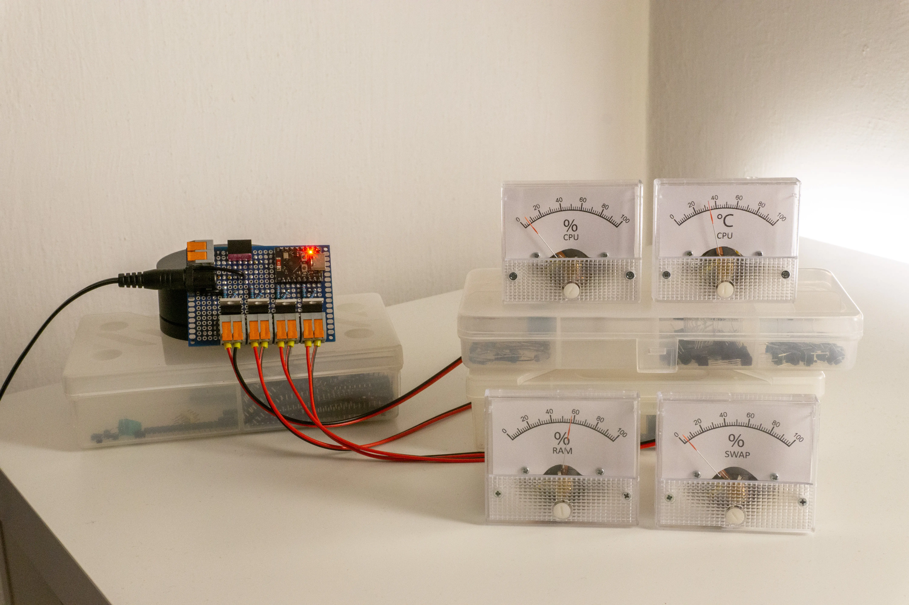
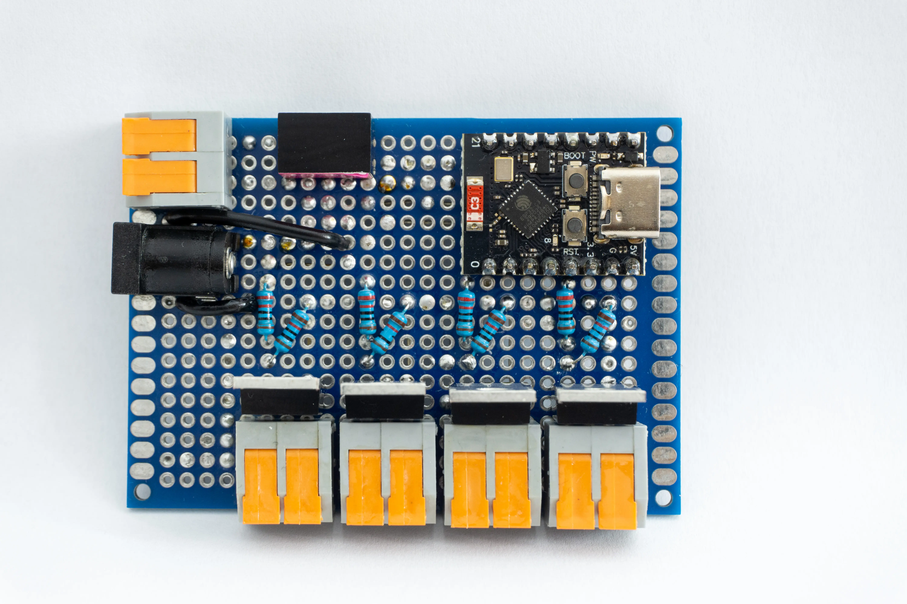
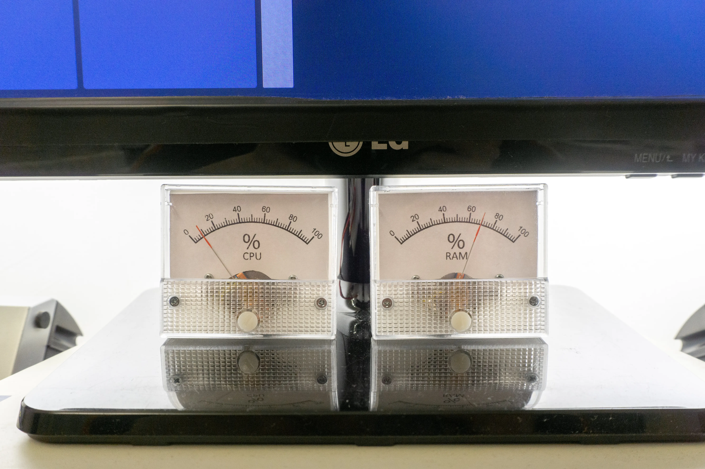

# PC metrics gauge

One day, I had the idea to use analog volt meter to display some value other than voltage, so I made this. Why pc metrics? Because that was the first thing that came to my mind.

## How does it work? ##
My original idea was to use 2 mosfets + current limiting resistors to charge or drain a capacitor to achaive a specific voltage level for the voltmeter, but then I realized I can just pwm it. Is it a *good* solution? Idk. I'm not an electrical engineer.

-----

